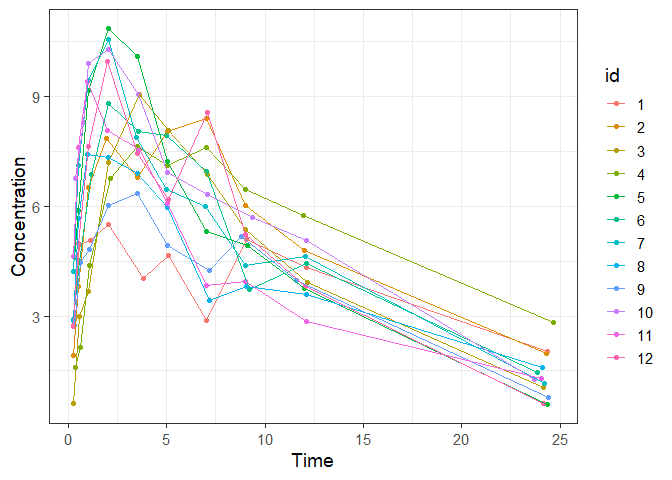
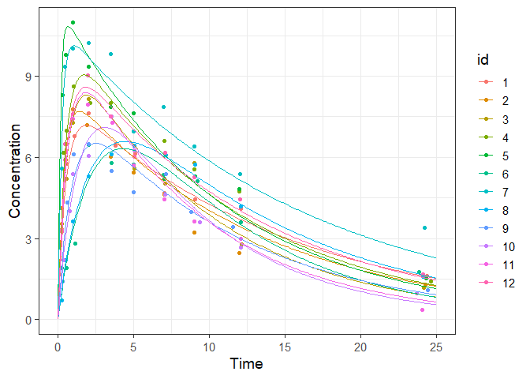
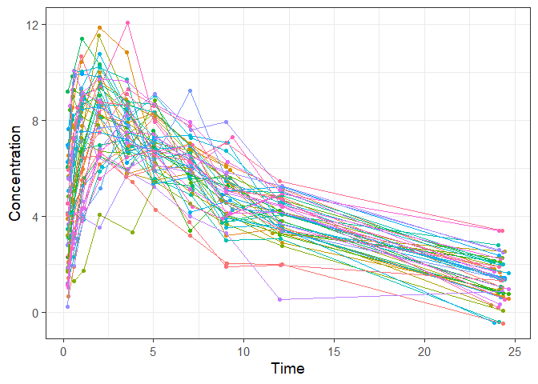
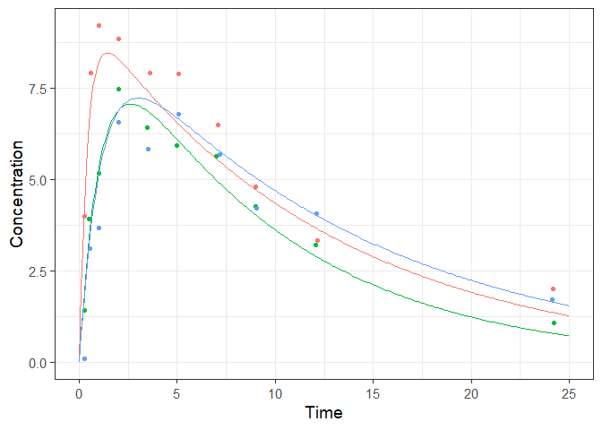
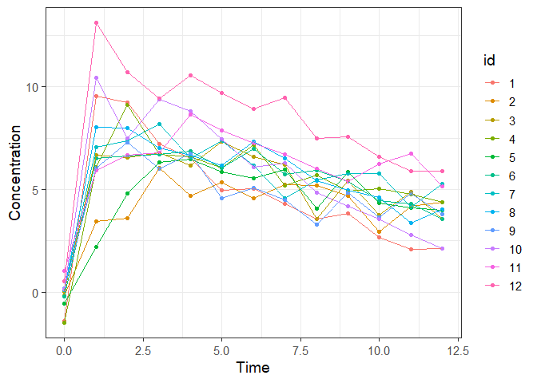
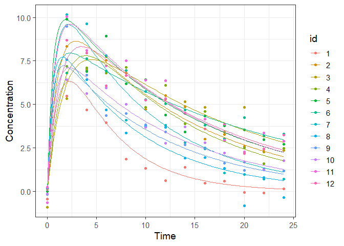
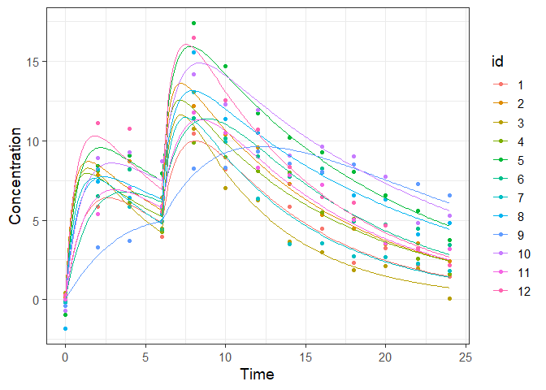
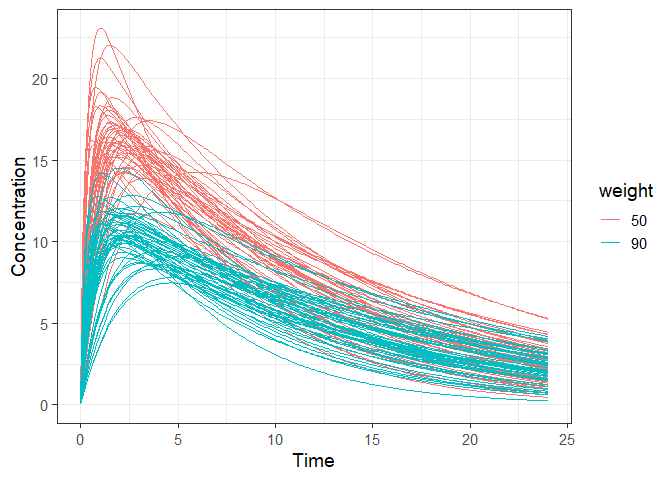

```r
library(tidyverse)
```

```
## -- Attaching packages ------------------------------------------------------------------- tidyverse 1.3.0 --
```

```
## v ggplot2 3.3.0     v purrr   0.3.3
## v tibble  3.0.0     v dplyr   0.8.5
## v tidyr   1.0.2     v stringr 1.4.0
## v readr   1.3.1     v forcats 0.5.0
```

```
## -- Conflicts ---------------------------------------------------------------------- tidyverse_conflicts() --
## x dplyr::filter() masks stats::filter()
## x dplyr::lag()    masks stats::lag()
```

```r
library(mlxR)

theme_set(theme_bw(base_size=14))
```


## Simulate a trial using the original design

[PK example link](http://simulx.webpopix.org/case-studies/workflow-pk1/)


```r
project.file <- 'monolixRuns/theophylline_project.mlxtran'
sim.res1 <- simulx(project = project.file)
```

```
## [INFO] The lixoftConnectors package has been successfully initialized:
## lixoftConnectors package version -> 2019.2
## Lixoft softwares suite version   -> 2019R2
```

```r
#sim.res1
```

sim.res1 contains 4 list.   

* list1 ; y1 ; observed data
* iist2 ; treatment ; dosing data
* list3 ; originalId 
* list4 ; population ; population parameters


```r
ggplot(data = sim.res1$y1, aes(time, y1, colour=id))+
  geom_point()+
  geom_line()+
  scale_x_continuous("Time") + scale_y_continuous("Concentration")
```

<!-- -->

## Remove the residual error

1) First, parameter `b` was set as 0.  
2) Add individual predicted value `Cc` in the simulated result.  
3) Simulation using updated output and parameters


```r
sim.param <- c(b=0)
out <- list(name = 'Cc', time = seq(0, 25, by=0.1))
sim.res2 <- simulx(project = project.file,
                   output = out,
                   parameter = sim.param)

ggplot()+
  geom_point(data = sim.res2$y1, aes(time, y1, colour=id))+
  geom_line(data = sim.res2$Cc, aes(time, Cc, colour=id))+
  scale_x_continuous("Time") + scale_y_continuous("Concentration")
```

<!-- -->

```r
#sim.res2
```

## Simulate a trial with N individuals

If we want to simulate more subjects using same population parameters?


```r
n_sim <- 50

sim.res3 <- simulx(project = project.file,
                   group = list(size = n_sim))

ggplot()+
  geom_point(data = sim.res3$y1, aes(time, y1, colour=id))+
  geom_line(data = sim.res3$y1, aes(time, y1, colour=id))+
  scale_x_continuous("Time") + scale_y_continuous("Concentration")+
  theme(legend.position = 'none')
```

<!-- -->

```r
n_sim <- 3

out  <- list(name = 'Cc', time = seq(0, 25, by=0.1))
sim.res3 <- simulx(project = project.file,
                   output = out,
                   group = list(size = n_sim))

ggplot()+
  geom_point(data = sim.res3$y1, aes(time, y1, colour=id))+
  geom_line(data = sim.res3$Cc, aes(time, Cc, colour=id))+
  scale_x_continuous("Time") + scale_y_continuous("Concentration")+
  theme(legend.position = 'none')
```

<!-- -->
## Define new observation times


```r
out  <- list(name = 'y1', time = (0:12))

sim.res4  <- simulx(project = project.file,
                    output = out)

print(ggplot(data=sim.res4$y1) + 
        geom_point(aes(x=time, y=y1, colour=id)) +
        geom_line(aes(x=time, y=y1, colour=id)) +
        scale_x_continuous("Time") + scale_y_continuous("Concentration"))
```

<!-- -->

```r
#sim.res4
```

## Output the predicted concentrations, the individual parameters and the covariates


```r
out1  <- list(name = 'y1', time = seq(0, 24, by=2))
out2  <- list(name = 'Cc', time = seq(0, 24, by=0.1))
out3  <- list(name = c('V', 'Cl', 'WEIGHT'))

sim.res5  <- simulx(project = project.file,
                    output  = list(out1, out2, out3))

print(sim.res5$parameter)
```

```
##    id        V       Cl WEIGHT
## 1   1 33.17242 6.229210   79.6
## 2   2 29.89829 2.190148   72.4
## 3   3 32.75825 1.837992   70.5
## 4   4 29.76489 2.434536   72.7
## 5   5 28.48449 1.958421   54.6
## 6   6 36.01749 1.693132   80.0
## 7   7 26.79977 2.747371   64.6
## 8   8 34.64383 3.973871   70.5
## 9   9 37.94962 3.455335   86.4
## 10 10 37.29422 3.073386   58.2
## 11 11 28.30485 1.963843   65.0
## 12 12 30.59552 2.002609   60.5
```

```r
#sim.res5
```

```r
print(ggplot() + 
        geom_point(data=sim.res5$y1,aes(x=time, y=y1, colour=id)) +
        geom_line(data=sim.res5$Cc,aes(x=time, y=Cc, colour=id)) +
        scale_x_continuous("Time") + scale_y_continuous("Concentration"))
```

<!-- -->

## Specify the administration schedule


```r
adm   <- list(time = c(0,6), amount = c(320, 320))

sim.res6  <- simulx(project   = project.file,
                    treatment = adm,
                    output    = list(out1, out2))

print(ggplot() + 
        geom_point(data=sim.res6$y1,aes(x=time, y=y1, colour=id)) +
        geom_line(data=sim.res6$Cc,aes(x=time, y=Cc, colour=id)) +
        scale_x_continuous("Time") + scale_y_continuous("Concentration"))
```

<!-- -->

## pecify own WEIGHT covariates for N patients

```r
N       <- 100
weight <- list( name     = 'WEIGHT', 
                colNames = c('id', 'WEIGHT'),
                value    = cbind(c(1:N),c(rep(50, N/2), rep(90, N/2))))

adm   <- list(time = 0, amount = 500)

sim.res7 <- simulx(project = project.file, 
                   output = list(out1, out2),
                   treatment = adm,
                   parameter = weight)

sim.res7$Cc$weight <- 50
sim.res7$Cc$weight[as.numeric(sim.res7$Cc$id)>N/2] <-90
sim.res7$Cc$weight <- as.factor(sim.res7$Cc$weight)

print(ggplot() + 
        geom_line(data=sim.res7$Cc,aes(x=time, y=Cc, group=id, colour=weight)) +
        scale_x_continuous("Time") + scale_y_continuous("Concentration"))
```

<!-- -->


